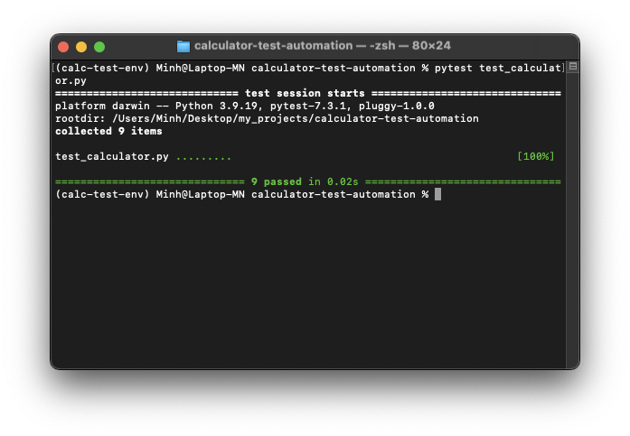
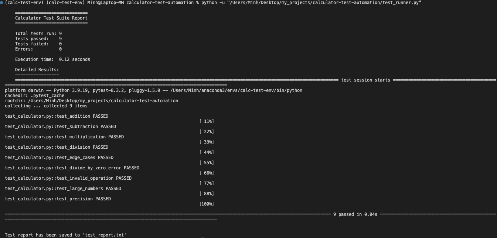
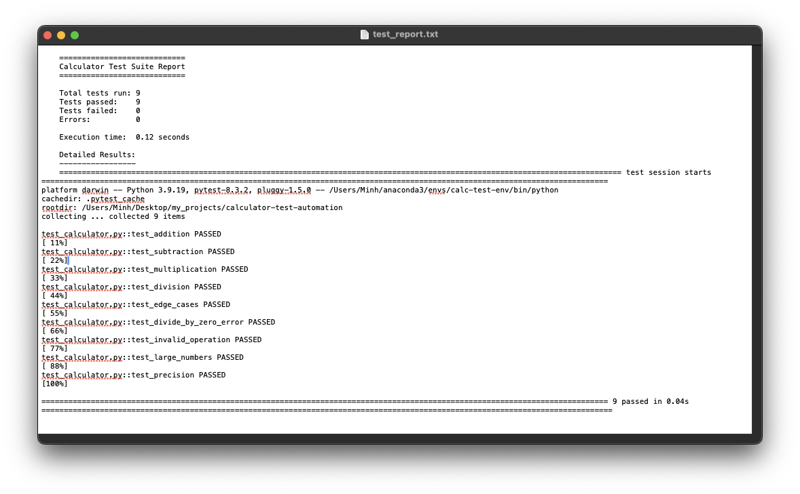

# Calculator Test Automation Project

## Project Overview
This project demonstrates test automation skills for a basic calculator function using Python. It was developed as a one-day project to showcase abilities in test case design, automation, and result analysis.

## Features
- Basic calculator function implementation
- Comprehensive test suite covering various scenarios
- Automated tests using pytest
- Custom test runner script with result reporting

## Project Structure
- `calculator.py`: Contains the basic calculator function
- `test_calculator.py`: Implements the automated tests using pytest, including all test cases
- `test_runner.py`: Custom script to run all tests and generate a report
- `requirements.txt`: Lists all Python package dependencies

## Setup and Installation

1. (in terminal) Clone the repository:
    ```
    git clone "insert link"
    ```

2. (in terminal) Navigate to the project directory:
    ```
    cd calculator-test-automation 
    ```

3. (in terminal) Create a Conda environment (IF you're using Conda. You can also use pyenv if you prefer  that):
    ```
    conda create --name calc-test-env python=3.9
    ```

4. (in terminal) Activate the Conda environment:
    ```
    conda activate calc-test-env
    ```
5. (in terminal) Install required packages:
    ```
    conda install pytest=8.3.2
    ```
## Running the Tests

### Using pytest directly

To run the tests using pytest, use the following command:

    pytest test_calculator.py



### Using the custom test runner

To run the tests and generate a detailed report, use the following command:
    
    python test_runner.py



This will execute all tests, display a summary in the console, and save a detailed report to `test_report.txt`.



## Reviewing Test Results

After running the tests using the custom test runner:

1. Check the console output for a summary of test results.
2. Open `test_report.txt` to view the detailed test report, including:
   - Total number of tests run
   - Number of tests passed, failed, and errors
   - Execution time
   - Detailed results for each test

## Modifying Tests

To add or modify tests:

1. Open `test_calculator.py`
2. Add new test functions or modify existing ones
3. Run the tests again to verify your changes

## Author
Minh Nguyen

## License
This project is open source and available under the [MIT License](LICENSE).
